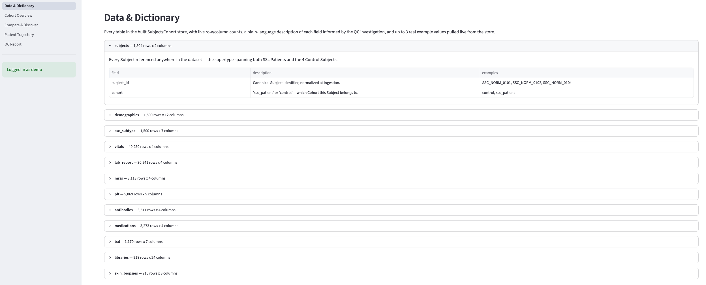
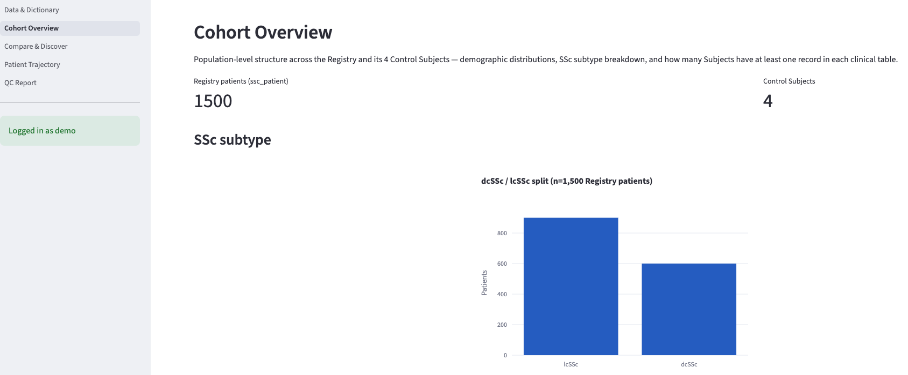
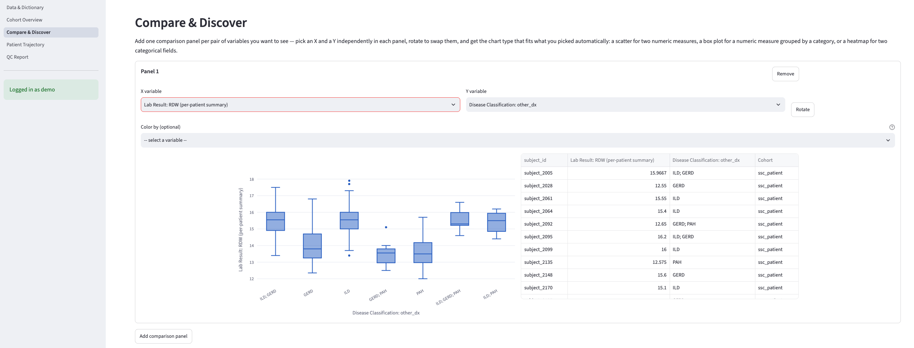
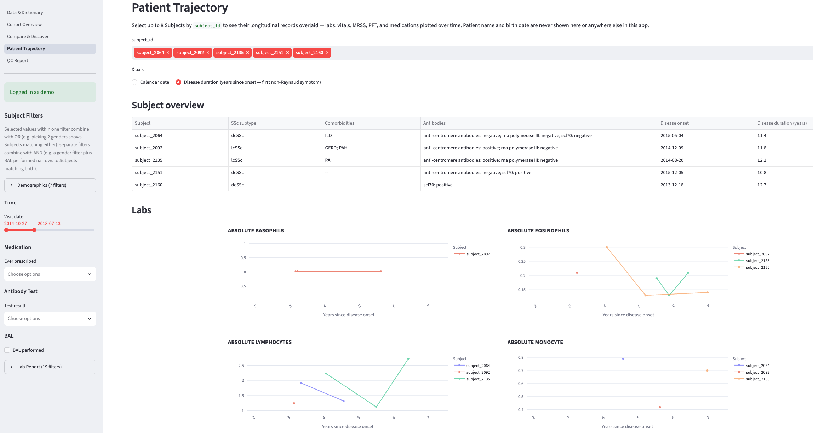

```{python}
#| label: setup
import sys
from pathlib import Path

PROJECT_ROOT = Path.cwd().parent
if str(PROJECT_ROOT) not in sys.path:
    sys.path.insert(0, str(PROJECT_ROOT))

import matplotlib.pyplot as plt
import pandas as pd
import seaborn as sns

from data.access import list_subjects, table_coverage
from data.store import build_encrypted_store, open_store

NU_PURPLE = "#4E2A84"
sns.set_theme(style="whitegrid")
palette = [NU_PURPLE, "#B5A1CC", "#1A1A1A", "#6E6E6E"]
sns.set_palette(palette)
pd.set_option("display.max_columns", 50)

build_encrypted_store()
conn = open_store()
subjects = list_subjects(conn)
```

# Agenda

::: {.incremental}
- Understanding the dataset
- The application & visualizations
- Data-quality issues and analytical findings
- Design decisions and tradeoffs
- Future work & discussion
:::

::: {.notes}
20 minutes total. Weighted toward findings and tradeoffs — that's where the
judgment calls live, and judgment is what this talk is meant to demonstrate.
:::

# Understanding the Dataset

## What's in the box

- 11 CSVs, ~4 MB, synthetic and non-PHI
- A patient/subject identifier under **4 different column names** across
  files — normalized to one canonical `subject_id` at ingestion
- The **Registry**: `demographics` + `ssc_subtype`, a 1:1, 1,500-row master
  list — every row `study=SSC-REG`, `diagnosis=SSc`
- Every other table: a **partial-coverage** table of clinical/molecular
  events for a subset of those 1,500 patients

::: {.notes}
Coverage ranges from 150 patients with a skin biopsy up to 1,503 with any
vitals record — worth stating up front so table coverage doesn't read as
missing data later.
:::

## Population and table coverage

```{python}
#| label: cohort-and-coverage
#| fig-width: 9
#| fig-height: 4

fig, axes = plt.subplots(1, 2, figsize=(9, 4), gridspec_kw={"width_ratios": [1, 2]})

cohort_counts = subjects["cohort"].value_counts()
sns.barplot(x=cohort_counts.index, y=cohort_counts.values, ax=axes[0])
axes[0].set_xlabel("")
axes[0].set_ylabel("Subjects")
axes[0].set_title(f"Cohort (n={len(subjects)})")
for i, v in enumerate(cohort_counts.values):
    axes[0].text(i, v + 15, str(v), ha="center")

cov = table_coverage(conn).sort_values("subject_coverage")
sns.barplot(x="subject_coverage", y="table", data=cov, ax=axes[1], color=NU_PURPLE)
axes[1].set_xlabel("Share of Subjects with >=1 record")
axes[1].set_ylabel("")
axes[1].set_title("Per-table Subject coverage")
axes[1].set_xlim(0, 1.05)

plt.tight_layout()
plt.show()
```

::: {.notes}
1,500 SSc Patients + 4 Control Subjects. Coverage panel shows which tables
are near-universal (vitals) vs sparse (skin biopsies) — sets up why some
findings below only affect a subset of patients.
:::

## A hidden second cohort

::: {.finding}
4 subject IDs (`SSC_NORM_0101/0102/0104/0110`) appear in `libraries.csv` —
but **never** in the Registry.
:::

- `libraries.csv`'s own comments confirm these are "healthy control
  sample[s]" used as a comparator arm for the RNA-seq work
- Modeled explicitly as a **Subject supertype** with a **Cohort**
  attribute (`ssc_patient` vs `control`) — not orphaned/invalid IDs
- A real structural finding, not a data error
- The QC key-linkage check automates this: confirms all 4 against the
  known set, and would flag any *future* out-of-Registry `subject_id`
  that doesn't match — currently 0 such IDs

## Static vs. longitudinal, and a naming trap

- `lab_report`, `vitals`, `mrss` — long-format, one **Observation**
  abstraction in code (Lab Result / Vital Sign / MRSS stay distinct
  terms in any user-facing view)
- `bal`, `medications`, `skin_biopsies` — event-based, not scheduled
- `demographics`/`ssc_subtype` — static, one row per patient

::: {.finding}
`ssc_subtype.other_dx` looks like a differential diagnosis field — it's
actually semicolon-separated comorbidity flags (ILD, GERD, PAH). Every
Registry patient's `diagnosis` is SSc regardless of `other_dx` content.
:::

# The Application

## Streamlit, 4 tabs, SQLite-backed

- **Data & Dictionary** — schema, coverage, QC report link
- **Cohort Overview** — population-level distributions
- **Compare & Discover** — free-form variable picker across any
  table/level, with a Control Subject overlay toggle
- **Patient Trajectory** — one patient's longitudinal record

Login + at-rest encryption + audit logging gated behind a published demo
account (details in Design Decisions).

::: {.notes}
Live app: nw-ssc-de.streamlit.app, demo/SscDemo2026!. Screenshots below are
the fallback if the network/projector doesn't cooperate — keep this tab
open live for the walkthrough.
:::

## Data & Dictionary

{fig-alt="Data & Dictionary tab screenshot"}

## Cohort Overview

{fig-alt="Cohort Overview tab screenshot"}

## Compare & Discover

{fig-alt="Compare & Discover tab screenshot"}

## Patient Trajectory

{fig-alt="Patient Trajectory tab screenshot"}

# Data-Quality Issues and Analytical Findings

## Height recorded in mixed units

```{python}
#| label: height-bimodal
#| fig-width: 7
#| fig-height: 3.5

height = pd.read_sql("SELECT height FROM demographics", conn)["height"].dropna()
fig, ax = plt.subplots(figsize=(7, 3.5))
sns.histplot(height, bins=40, ax=ax, color=NU_PURPLE)
ax.axvline(100, color="#1A1A1A", linestyle="--", linewidth=1)
ax.set_xlabel("Recorded height value")
ax.set_title("demographics.height — clean bimodal split at 100")
plt.tight_layout()
plt.show()
```

::: {.finding}
1,235 of 1,500 patients in **inches** (54.7-78.5); the other 265 in
**centimeters** (141.3-194.7 cm). Fixed at ingestion: cm-scale values
converted to inches, raw CSV left untouched.
:::

## One high-confidence data-entry error

::: {.finding}
`demographics.csv` lists `subject_8545`'s weight as **22.5** (impossible
for a living adult) — but 5 separate `vitals.csv` visits spanning 2017-2020
all report ~160.6 lbs for the same patient.
:::

**Decision:** flagged in the QC report, not silently corrected. The
vitals-based value is well-evidenced, but `demographics.weight` is a
distinct static field with no documented derivation from vitals —
overwriting it would assert a number we don't have provenance for.

## A synthetic-data placeholder, not a clinical signal

```{python}
#| label: weight-spike
#| fig-width: 7
#| fig-height: 3.5

vitals = pd.read_sql(
    "SELECT subject_id, vital_type_name_category, vital_value FROM vitals", conn
)
weight = vitals[vitals["vital_type_name_category"] == "WEIGHT IN POUND"]
top_weights = weight["vital_value"].value_counts().head(10)

fig, ax = plt.subplots(figsize=(7, 3.5))
sns.barplot(x=top_weights.index.astype(str), y=top_weights.values, ax=ax, color=NU_PURPLE)
ax.set_xlabel("WEIGHT IN POUND value")
ax.set_ylabel("Records")
ax.set_title("Most common recorded weight values")
plt.xticks(rotation=45, ha="right")
plt.tight_layout()
plt.show()
```

::: {.finding}
`WEIGHT IN POUND = 160.6` appears 870 times across 195 distinct patients —
the next most common value appears only 39 times. Some patients show this
exact value on *every* visit across multiple years.
:::

`check_constant_value_across_visits`: flags a value dominating far more
*patients* than expected if personal-constant values were spread evenly —
160.6 scores ~106x expectation; the next-highest (BP diastolic=77) scores
only ~16-22x.

## The same pattern in BP and pulse, measured differently

The per-patient check above is blind to a filler used on only *some* of a
patient's visits. Looking at each value's share of *every* record instead:

| Measure | Value | Share of all records | vs. local background |
|---|---|---|---|
| BP SYSTOLIC | 124 | 25% of 7,848 | 11.7x |
| BP DIASTOLIC | 77 | 25% of 7,848 | 5.7x |
| PULSE | 76 | 16% of 8,381 | 4.6x |

`check_value_spike`: a needle sitting on an otherwise ordinary
distribution, not a natural bell-curve mode. Reported as advisory findings
alongside 160.6 — not corrected or dropped.

## PFT bounds look like generator clipping

```{python}
#| label: pft-bounds
#| fig-width: 7
#| fig-height: 3.5

pft = pd.read_sql('SELECT "DESCRIPTION", "ORD_VALUE" FROM pft', conn)
pft["value"] = pd.to_numeric(pft["ORD_VALUE"], errors="coerce")
targets = ["FVC", "FEV1", "DLCO_SB"]
pft = pft[pft["DESCRIPTION"].isin(targets)].dropna(subset=["value"])

fig, ax = plt.subplots(figsize=(7, 3.5))
sns.boxplot(x="DESCRIPTION", y="value", data=pft, ax=ax, color=NU_PURPLE)
ax.axhline(40.0, color="#1A1A1A", linestyle="--", linewidth=1)
ax.axhline(130.0, color="#1A1A1A", linestyle="--", linewidth=1)
ax.set_xlabel("")
ax.set_ylabel("% predicted")
ax.set_title("FVC / FEV1 / DLCO_SB — identical 40.0-130.0 bounds")
plt.tight_layout()
plt.show()
```

::: {.finding}
Three physiologically unrelated measures all range **exactly 40.0-130.0%
predicted**. A clean guideline-range check here is itself the finding —
reported as a result, not treated as "nothing to see."
:::

## The same generic check finds real injected errors

Running `check_guideline_range` against `lab_report.csv` for the first
time surfaces isolated, physiologically-impossible values nobody had
manually audited:

- `ABSOLUTE LYMPHOCYTES`, `MCH`, `MCHC` — one `9999` sentinel each
- `WBC` — two `999` sentinels
- `HEMOGLOBIN`, `NEUTROPHILS`, `LYMPHOCYTES`, `MCV`, `NM BKR ABSOLUTE NEUTROPHIL`
  — 1-2 negative values each (impossible for any of those measures)

::: {.finding}
A generic check earns its keep here: it wasn't built to find these
specifically, it found them because it was pointed at a table nobody had
audited yet.
:::

::: {.notes}
Guideline ranges are QC thresholds, not diagnostic cutoffs — worth stating
if asked, since some of these ranges (e.g. PFT 30-150) are wider than a
clinician's normal reference range on purpose, to avoid false-flagging
real disease-driven abnormal values.
:::

## Medications: names fragmented, doses mostly clean

::: {.finding}
Only 17 distinct medication strings total — but `CellCept` (192),
`mycophenolate mofetil` (211), and `MMF` (189) are the same drug under
three names. Merged, the total (592) is nearly 2.5x the next
most-prescribed drug (rituximab, 253).
:::

- **Dose**: only 24 distinct strings; a few look like intentionally
  injected errors — negative doses, `999 tablets daily`, `250 g twice
  daily` (likely a mg/g slip, ~1000x too high), `500 mL tablets daily`
  (a volume unit on a solid dosage form)
- **Two distinct, non-overlapping gaps**: 20 rows have dose but no
  medication name; 85 rows have medication name but no dose — no row has
  both blank
- Fixed at ingestion (canonicalized label, original preserved); dose
  built as a 24-row lookup table, both cleaning display and powering the
  implausibility flags

## PII-shaped fields in a synthetic dataset

::: {.finding}
`demographics` has first/last name and birth date; `mrss`/`skin_biopsies`
have `ENTRY_USER_NAME` (a clinician name) — despite the dataset being
confirmed synthetic/non-PHI.
:::

**Decision:** patient name/DOB suppressed everywhere downstream
(`subject_id` + age-at-event only) — a deliberate demonstration of
PHI-handling judgment. `ENTRY_USER_NAME` kept visible: provider-side
operational metadata, not what HIPAA governs, and useful for a "does
score entry vary by rater?" angle.

Full report: `docs/qc_report.md`, generated by `uv run python -m data.qc`.

# Design Decisions and Tradeoffs

## HIPAA controls, implemented literally

Real login, real encryption at rest, real audit logging — despite the data
being confirmed synthetic/non-PHI and the deliverable requiring a public
repo + public app link.

Gated by a published demo account, so the controls are **genuine
engineering rather than theater**, without blocking reviewer access.

*(ADR 0001)*

## Encrypt the store, not the source CSVs

- Keeps the repo **clone-and-run reproducible** — a reviewer can inspect
  the actual source data directly
- Still gives a real "encryption at rest" component to explain: the
  runtime SQLite store the app/notebook actually reads from is encrypted

*(ADR 0002)*

## SQLite with a Subject supertype, not pandas end-to-end

Chosen specifically because it **models the Control Subject / Registry
relationship correctly** — cohort membership, not a foreign-key violation
to explain away.

The role's own scope ("data modeling across clinical data sources")
rewards showing schema design even at a data size where SQL isn't
strictly necessary for performance.

*(ADR 0005)*

## Demo secrets committed, against normal practice

The credentials and encryption key are **deliberately public by design**
(same reasoning as the HIPAA-literal controls) — keeping them out of git
would only add setup friction for reviewers, with no actual security
benefit.

Documented explicitly as a demo-only deviation.

*(ADR 0004)*

## Scope triage under a same-day deadline

- Flat package layout over a layered architecture
- Minimal-but-real CI: ruff + mypy + pytest via GitHub Actions
- Targeted tests over exhaustive coverage
- The originally-planned 5th "discovery" app page merged into the
  group-comparison page once it became clear they were the same
  free-form explorer

# Future Work

::: {.future-work}
Known, deliberately scoped — not bugs. The app is stable, tested,
deployed, green.
:::

**Addressed since the initial clinical read:**

- Disease-duration x-axis (years-since-onset toggle, alongside calendar
  date) — Patient Trajectory & Cohort Overview
- Patient Trajectory subject header — subtype, comorbidities, antibodies,
  disease onset/duration
- Compare & Discover "color by" facet — a first step toward
  subtype/antibody-faceted outcome views

**Still open:**

- No event overlay (BAL/skin-biopsy dates) on trajectory charts
- Medications not classed (disease-modifying vs. symptomatic)

**Considered and intentionally out of scope:**

- PFT >=10% relative FVC decline flagging — raw values shown instead
- `lab_report.csv` has no creatinine/troponin/BNP — renal-crisis and
  cardiac-involvement signals are structurally unobservable from labs in
  this dataset (documented as a data limitation in `CONTEXT.md`, not a
  code gap)

## Thank you — discussion

Repo: (public GitHub link) &nbsp;&middot;&nbsp; App:
[nw-ssc-de.streamlit.app](https://nw-ssc-de.streamlit.app/)



# Appendix {visibility="uncounted"}

## Appendix: HIPAA-style controls, in detail

- **Login**: gated by a published demo account (`demo` /
  `SscDemo2026!`) — a demonstration of the control, not a real access
  boundary
- **Encryption at rest**: the runtime SQLite store is built encrypted
  from the source CSVs at startup; source CSVs themselves are left
  plaintext for reviewer reproducibility
- **Audit logging**: every login attempt (success/failure) appended to
  a local `audit.log` with timestamp and user; does not persist across
  restarts under the chosen ephemeral hosting (documented limitation)
- Full reasoning: `docs/adr/0001-hipaa-controls-with-public-demo-credentials.md`,
  `docs/adr/0002-*.md`, `docs/adr/0004-*.md`

## Appendix: QC methodology detail

`check_constant_value_across_visits` — per-patient dominance ratio:
share of patients for whom a value is invariant across *all* their
visits, vs. expectation if personal-constant values were spread evenly
across observed distinct values. Requires >=2 visits, >=10 subjects.

`check_value_spike` — population-level share of *every* record for a
measure landing on one value, vs. the local background set by its
nearest numeric neighbors. Complementary to the check above: catches a
filler used on only some of a patient's visits, which the per-patient
check is blind to.

`check_guideline_range` — generic, reusable against any numeric
measure with a defined reference range; found the `lab_report.csv`
sentinel values without being built to look for them specifically.

## Appendix: Future-work gaps, expanded

Originally 7 gaps flagged from a clinical read of the app
(`.scratch/HANDOFF.md`, "What's NOT done — real gaps, not polish"). Since
then: 3 addressed (disease-duration axis, Patient Trajectory subject
header, Compare & Discover color-by), 1 folded into `CONTEXT.md` as a
documented data limitation, 1 dropped after consideration (PFT decline
flagging). The 2 still open (event overlay, medication classing) read as
*"what would make this SSc-domain-aware rather than
generic-longitudinal-EHR-browser-aware"* to a pulmonary-research
committee specifically — not code-quality gaps.
